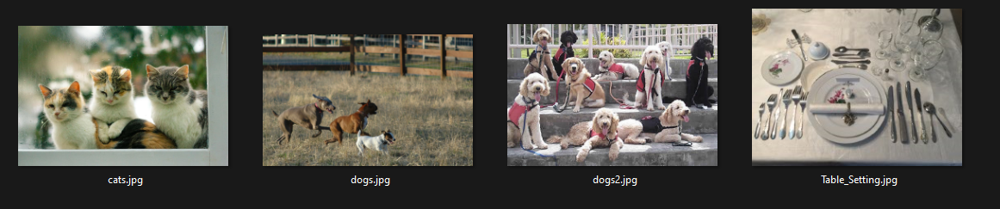
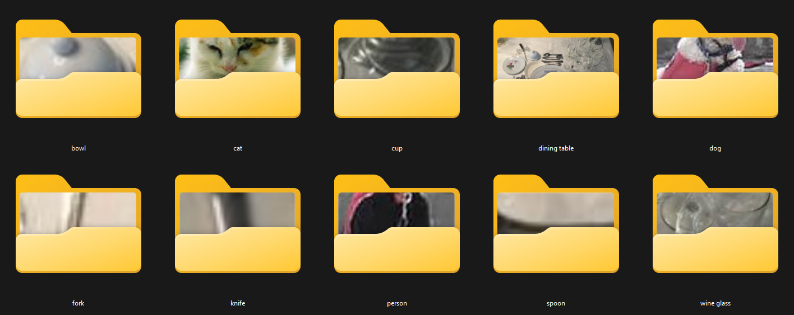
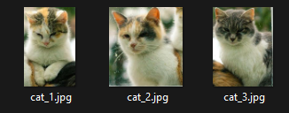
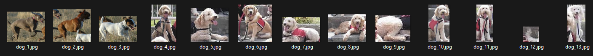
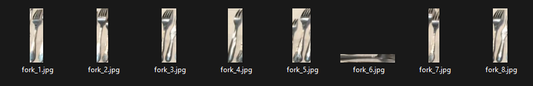

# Object Detection and Cropping with DETR

This Python script uses the DETR (DEtection TRansformer) model for object detection in images, and provides an easy-to-use GUI for users to interact with the program. The GUI allows users to select an input directory of images and an output directory to store the cropped images. The users can also set a confidence level for the object detection model.

## Dependencies

The script uses the following Python packages:

- `tkinter` for the GUI
- `PIL` (Pillow) for image manipulation
- `transformers` for using the DETR model
- `torch` for tensor and model-related operations
- `requests` and `os` for handling file operations

You can install these dependencies using pip:

```
pip install tkinter pillow transformers torch requests
```

## Usage

1. Run the script. A GUI window will open.
2. Click on "Select Input Folder" to choose the directory containing the images you want to process.
3. Click on "Select Output Folder" to choose the directory where you want to save the cropped images.
4. Adjust the "Confidence" slider to set the confidence level for the DETR model. The higher the confidence level, the more certain the model has to be to identify an object.
5. Click on "Submit" to start the object detection and image cropping process. The script will then iterate over all images in the input directory, use the DETR model to detect objects in each image, and save the cropped images in the output directory. The cropped images are stored in folders named after the detected object's label.

## Output

The script will print the label of each detected object, the confidence level of the detection, and the location of the object in the image. If the output directory does not already contain a folder named after the object's label, the script will create one.

## Note

The model used in this script is DETR ResNet-50, which is pre-trained on the COCO dataset. This dataset includes 91 different object types, so the model can detect a wide range of common objects in images.

Please make sure that the selected input directory contains valid image files only, as the script does not handle non-image files or corrupted image files.

---
## Example

###Input Folder


###Output Folder


###Some Contents




